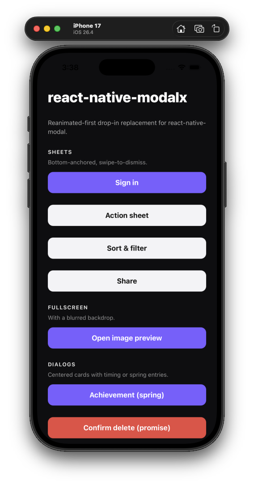
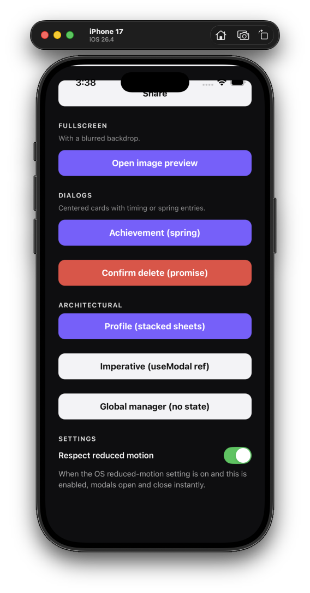

# react-native-modalkit

> Modern, [Reanimated](https://docs.swmansion.com/react-native-reanimated/)-first **drop-in replacement** for [`react-native-modal`](https://github.com/react-native-modal/react-native-modal). Same props you know, all running on the UI thread, plus an imperative API, queue-aware `<ModalProvider>`, and gesture v2 swipes.

[](https://www.npmjs.com/package/react-native-modalkit)
[](./LICENSE)

<p align="center">
  
  &nbsp;
  
</p>

## Why?

`react-native-modal` was great for years, but the project is **no longer actively maintained** and has **no support for the New Architecture (Fabric / TurboModules)**. It still leans on `react-native-animatable`, the legacy `Animated` API, and `PanResponder` — all of which are showing their age on modern React Native. Apps adopting the New Arch (default in RN 0.76+) hit edge cases the upstream library can't fix.

**modalkit** picks up where it left off: same API surface so migration is a one-line import change, but the internals are rebuilt on the modern stack.

- 🆕 Built for **React Native 0.78+** and the **New Architecture** (Fabric)
- ⚡ Animations driven by **Reanimated 3** worklets — no JS-thread jank
- 👆 Swipes powered by **`react-native-gesture-handler` v2** — plays nicely with nested scrollables
- 🪄 **Drop-in API** — change one import line, your existing props keep working
- 🧰 New: imperative `useModal()` hook, global `<ModalProvider>` + `ModalManager` for queue / stack-style modals
- 🦴 New: `position="bottom" | "top" | "center" | "fullscreen"` shortcut
- ♿️ New: respects the OS reduced-motion setting out of the box
- 🔁 New: reliable `onModalHide` timing — fires only after the native dismiss completes, so chained modals never stack and lock the screen

## Install

```sh
npm install react-native-modalkit react-native-reanimated react-native-gesture-handler
# or
yarn add react-native-modalkit react-native-reanimated react-native-gesture-handler
```

Then follow the standard setup steps for the two peers:

- [Reanimated installation guide](https://docs.swmansion.com/react-native-reanimated/docs/fundamentals/getting-started)
- [Gesture Handler installation guide](https://docs.swmansion.com/react-native-gesture-handler/docs/installation)

> Wrap your app in `<GestureHandlerRootView>` (most templates already do this).

### Peer dep matrix

| Peer                           | Required version |
| ------------------------------ | ---------------- |
| `react`                        | `>=18.3`         |
| `react-native`                 | `>=0.78`         |
| `react-native-reanimated`      | `>=3.10`         |
| `react-native-gesture-handler` | `>=2.16`         |

## Quick start

```tsx
import React, { useState } from "react";
import { View, Text, Button } from "react-native";
import Modal from "react-native-modalkit";

export const MyDialog = () => {
  const [isVisible, setIsVisible] = useState(false);

  return (
    <View>
      <Button title="Open" onPress={() => setIsVisible(true)} />
      <Modal
        isVisible={isVisible}
        onBackdropPress={() => setIsVisible(false)}
        onSwipeComplete={() => setIsVisible(false)}
        swipeDirection="down"
        position="bottom"
      >
        <View
          style={{ padding: 24, backgroundColor: "white", borderRadius: 12 }}
        >
          <Text>Hello modalkit 👋</Text>
        </View>
      </Modal>
    </View>
  );
};
```

## Migrating from `react-native-modal`

For most projects, this is the entire diff:

```diff
- import Modal from "react-native-modal";
+ import Modal from "react-native-modalkit";
```

Every public prop carries the same name and same shape. Your `animationIn="slideInUp"`, your `swipeDirection={["up", "down"]}`, your `customBackdrop`, your `onModalHide` — all keep working.

A few props that no longer make sense are accepted with a one-time dev warning:

| Prop                         | Status                                                 |
| ---------------------------- | ------------------------------------------------------ |
| `useNativeDriver`            | accepted, no-op (Reanimated already runs on UI thread) |
| `useNativeDriverForBackdrop` | accepted, no-op                                        |

### Coming from one of my older modal libraries?

Modalkit supersedes both of these — they're now archived:

- [`react-native-global-modal-2`](https://github.com/kuraydev/react-native-global-modal-2)
  — replace `<GlobalModal>` with `<ModalProvider>`, and `ModalController.show/hide`
  with `ModalManager.show/hide`. Same imperative shape, plus everything
  on that library's roadmap (alerts, action sheets, bottom sheets,
  gestures, accessibility) — and no more `react-native-modal` peer dep.
- [`react-native-modal-2`](https://github.com/kuraydev/react-native-modal-2)
  — `<Modal visible>` becomes `<Modal isVisible>`, `<AnimatedModal>` collapses
  back into the same `<Modal>` (it's animated by default), and animation
  strings change from `animationType="fade"` /
  `animationIn="slide" + animationDirection="up"` to standard preset names
  (`fadeIn`, `slideInUp`, `bounceIn`, `zoomIn`). Backdrop props pass through
  unchanged. All animations now run on the UI thread via Reanimated 3.

### Custom animations

If you used `react-native-animatable`'s `registerAnimation`, modalkit ships an equivalent:

```ts
import { registerAnimation } from "react-native-modalkit";

registerAnimation("myFancySlide", {
  from: { opacity: 0, translateY: 200 },
  to: { opacity: 1, translateY: 0 },
});
```

## Imperative API

For modals you don't want to wire to your render state:

```tsx
import { useModal, Modal } from "react-native-modalkit";

const Screen = () => {
  const modal = useModal();

  return (
    <>
      <Button title="Open" onPress={modal.show} />
      <Modal ref={modal.ref} swipeDirection="down" onSwipeComplete={modal.hide}>
        <Sheet onClose={modal.hide} />
      </Modal>
    </>
  );
};
```

`useModal()` returns:

- `ref` — pass to `<Modal ref={...} />`
- `show()`, `hide()`, `toggle()` — imperative controls
- `isVisible` — current visibility (synchronous read)
- `isVisibleProp` — convenience: pass to a controlled `<Modal isVisible={...} />`

## Queueing modals globally

For things like global confirms / alerts, mount a `<ModalProvider>` at the app root and dispatch via `ModalManager`:

```tsx
// App.tsx
import { ModalProvider } from "react-native-modalkit";

export default function App() {
  return (
    <GestureHandlerRootView style={{ flex: 1 }}>
      <ModalProvider>
        <AppNavigator />
      </ModalProvider>
    </GestureHandlerRootView>
  );
}
```

```tsx
// anywhere
import { ModalManager, Modal } from "react-native-modalkit";

const id = ModalManager.show(
  <Modal
    isVisible
    position="bottom"
    onBackdropPress={() => ModalManager.hide(id)}
  >
    <ConfirmDialog />
  </Modal>,
);
```

## Animation configs

`animationIn` / `animationOut` accept any of:

```tsx
// 1. Built-in preset name (same names as react-native-modal)
<Modal animationIn="slideInUp" animationOut="slideOutDown" />

// 2. Custom keyframe object (react-native-animatable shape)
<Modal animationIn={{ from: { opacity: 0, scale: 0.7 }, to: { opacity: 1, scale: 1 } }} />

// 3. Reanimated config — full control, springs supported.
//    Pair with `preset` so the physics drives a visible transform.
<Modal animationIn={{ type: "spring", preset: "zoomIn", damping: 11, stiffness: 110 }} />
<Modal animationIn={{ type: "timing", preset: "slideInUp", duration: 250 }} />

// Without `preset`, the config drives the position default's frames
// (fadeIn for `position="center"`), which makes a spring's overshoot
// invisible — set `preset` if you want the boing.
```

### Built-in presets

`slideInUp`, `slideInDown`, `slideInLeft`, `slideInRight`, `slideOutUp`, `slideOutDown`, `slideOutLeft`, `slideOutRight`, `fadeIn`, `fadeOut`, `fadeInUp/Down/Left/Right`, `fadeOutUp/Down/Left/Right`, `zoomIn`, `zoomOut`, `bounceIn`, `bounceOut`, `flipInX/Y`, `flipOutX/Y`, `pulse`.

### Position shortcuts

```tsx
<Modal position="bottom">…</Modal>   // slideInUp / slideOutDown defaults, edge-to-edge
<Modal position="top">…</Modal>      // slideInDown / slideOutUp, with horizontal padding
<Modal position="center">…</Modal>   // fadeIn / fadeOut, with horizontal padding (default)
<Modal position="fullscreen">…</Modal>
```

Explicit `animationIn` / `animationOut` always override the position default.
`center` and `top` ship with `paddingHorizontal: 16` so dialogs don't reach
the screen edges; `bottom` and `fullscreen` stay edge-to-edge for sheets and
lightboxes.

### Styling — wrap your content

The Modal's `style` prop applies to the **outer layout container** (matching
`react-native-modal`'s convention). For a bottom sheet, dialog, or any
non-fullscreen content, wrap your body in a styled `<View>` so the layout
container stays transparent and the backdrop shows through above it:

```tsx
// ❌ Wrong — paints the whole screen white, content sits at the bottom of it
<Modal isVisible position="bottom" style={{ backgroundColor: "white" }}>
  <Text>Bottom sheet</Text>
</Modal>

// ✅ Right — the layout container stays transparent, only the inner view is white
<Modal isVisible position="bottom">
  <View style={{ backgroundColor: "white", padding: 24, borderTopLeftRadius: 24 }}>
    <Text>Bottom sheet</Text>
  </View>
</Modal>
```

## Lifecycle and chaining modals

Callbacks fire in this order on every close:

1. `onModalWillHide` — close animation is about to start
2. close animation runs (`animationOutTiming`)
3. native `<Modal>` dismisses (iOS plays its dismiss; Android instant)
4. `onModalHide` and `onDismiss` — fire **only after** the native window
   is fully gone

That last point matters: `onModalHide` is your "safe to dispatch the next
modal" signal. Anything you do inside it — a follow-up alert, navigation,
opening another sheet — runs against a clean iOS modal stack, so you don't
get the dreaded "screen unresponsive after close" issue:

```tsx
<Modal
  isVisible={visible}
  onBackdropPress={() => setVisible(false)}
  onModalHide={() => {
    // Safe to dispatch another modal here — the previous is fully gone.
    ModalManager.alert({ title: "Saved!" });
  }}
>
  …
</Modal>
```

Same guarantee for the promise-based helpers — `await` chains just work:

```tsx
const ok = await ModalManager.confirm({
  title: "Delete?",
  destructive: true,
});
if (ok) {
  await ModalManager.alert({ title: "Deleted" }); // safe; no stacking
}
```

## Props reference

All `react-native-modal` props are supported. modalkit-specific additions:

| Prop                   | Type                                            | Default    | Notes                                                    |
| ---------------------- | ----------------------------------------------- | ---------- | -------------------------------------------------------- |
| `position`             | `"center" \| "top" \| "bottom" \| "fullscreen"` | `"center"` | Layout + animation defaults shortcut                     |
| `respectReducedMotion` | `boolean`                                       | `true`     | Skip animations when the OS reduced-motion setting is on |
| `modalTestID`          | `string`                                        | —          | Forwarded to the underlying `<Modal>` host               |

See [`Modal.types.ts`](./src/components/Modal/Modal.types.ts) for the full surface.

## Example app

A minimal Expo app lives in [`example/`](./example):

```sh
cd example
npm install
npm run start
```

## Contributing

PRs welcome. The library is built with [`react-native-builder-bob`](https://github.com/callstack/react-native-builder-bob) and tested with Jest + RNTL.

```sh
npm install
npm run typecheck
npm run lint
npm test
npm run build
```

## License

MIT © [FreakyCoder](https://github.com/kuraydev)
